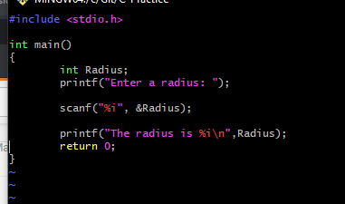
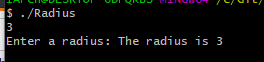

  
  <h1>Awesome Readme Template</h1>

  

    An awesome README template for your projects!
  

<!-- Badges -->

  
  
  
  
  
  

<h4>
    <a href="https://github.com/Louis3797/awesome-readme-template/">View Demo</a>
   · 
    <a href="https://github.com/Louis3797/awesome-readme-template">Documentation</a>
   · 
    <a href="https://github.com/Louis3797/awesome-readme-template/issues/">Report Bug</a>
   · 
    <a href="https://github.com/Louis3797/awesome-readme-template/issues/">Request Feature</a>
  </h4>

 

# Recreating printf()...the long way.

Welcome to the my repository! In here contains a project recreating the printf function without case or switch statements.This project was done trimester 1 at Holberton School Tulsa, and the project was written using the C programming language.

## Connect With Us

## Project Requirements
  - Compiler used to test code: gcc -Wall -Werror -Wextra -pedantic -std=gnu89 -Wno-format *.c
  - Authorized functions and macros:
    - write (man 2 write)
    - malloc (man 3 malloc)
    - free (man 3 free)
    - va_start (man 3 va_start)
    - va_end (man 3 va_end)
    - va_copy (man 3 va_copy)
    - va_arg (man 3 va_arg)
  - Tasks
    - Task 0: Write a function that produces output according to a format.You need to handle the following conversion specifiers: c, s, %
    - Task 1: Handle the following conversion specifiers: d, i
    - Task 3: Create a man page for your function.
  - Code must use Betty style. It will be checked using betty-style.pl and betty-doc.pl.
  - You are not allowed to use global variables.
  - No more than 5 functions per file.
  - The prototypes of all your functions should be included in your header file called main.h.
  - All your header files should be include guarded.
  - Note that we will not provide the _putchar function for this project.

## Project Screenshots

## Context to project

### File Description
  - main.h
    - The header file, used to declare function prototypes, macros, and data types that will be used across multiple source files.
    - Provides a common set of declarations that can be used by all source files in the project.
  - format_struct.c
    - This file defines a function named check_spec that checks if a given character is a valid format specifier for a custom printf-like function.
    - The function takes a pointer to a character (which is expected to be a format specifier like 'c', 's', '%', 'd', or 'i') and returns a function pointer to the appropriate function for handling that specifier.
  - printf.c
    - This file defines a function named _printf that is a simplified version of the standard printf function.
    - The function takes a format string and a variable number of arguments, and it prints the arguments according to the format string. The function then  returns the number of characters printed.
  - spec_functions.c
    - This file holds three functions; print_char, print_pct, and print_str.
    - These functions are used in conjunction with the _printf function to handle specific format specifiers ('c', 's', & '%').
  - putchar.c
    - This file houses a simple _putchar function that writes a character to the standard output (stdout).
    - The function takes a character c as input and uses the write system call to write that character to the file descriptor 1, which represents the standard output.
  - dec_spec.c
    - This file  defines a function named print_dec that is used to handle the '%d' and '%i' format specifiers.
    - This function is to print a decimal integer and return the length of the printed number.
  - man_3_printf
    - Manual with additional information of the functions and their intended purpose for this project.
#### Code Breakdown
  - format_struct.c
    1. Declares an array called 'b' of 'form_t' structures.
    1. Function loops over the array. Each structure in the array checks for 'type' member matches the character pointed by '*format'.
    1. If a match is found, it returns the 'f' member of the structure.
    1. If it doesnt match, return 'NULL'.
  - printf.c
    1. Intailizes a va_list named 'args'
    1. Checks if format string is NULL, return 0 if so.
    1. It then enters a loop that continues until it reaches the end of the format string. Checks if the current character is a % character.
    1. If it finds a % character, it increments the format pointer to get to the format specifier. Then checks if the format specifier is a '\0' character, which would mean that the format string ends with a % character. If it does, the function returns 0.
    1. Calls the 'check_spec' function to get a function pointer to the function that handles the format specifier. The 'check_spec' function is expected to return 'NULL' if the format specifier is not recognized.
    1. If 'check_spec' returns a non-NULL function pointer, it checks if the format specifier is a '.' character. If it is, it prints the '.' character and increments the count and the format pointer. It then calls the function pointed to by 'print_func' with args as the argument and adds the return value to 'count'.
    1. If 'check_spec' returns 'NULL', it prints a '%' character and the unrecognized format specifier, and increments count by 2.
    1. If the current character is not a '%' character, it prints the character and increments 'count'.
    1. Increments the format pointer to move to the next character.
    1. Calls va_end to clean up 'args'.
    1. Returns 'count', which is the total number of characters printed.
  - spec_functions.c
    1. print_char: This function is called when the format specifier is '%c'. It takes a variable argument list (va_list) as input and retrieves the next argument of type 'int' from the list. It then prints the character corresponding to that argument using 'putcha'r. The function returns 1 to indicate that one character has been printed.
    1. print_pct: This function is called when the format specifier is '%%'. It takes a va_list as input, but it doesn't use it. It simply prints the '%' character using 'putchar' and returns 1 to indicate that one character has been printed.
    1. print_str: This function is called when the format specifier is '%s'. It takes a va_list as input and retrieves the next argument of type 'char*' from the list. It then iterates over the characters in the string and prints each character using 'putchar'. It keeps track of the number of characters printed in the 'count' variable and returns that count.
  - dec_spec.c
    1. Inside the function, it retrieves the next argument of type 'int' from the va_list using the va_arg macro and assigns it to the variable 'x'.
    1. The function checks if 'x' is negative. If it is, it prints a minus sign (-) and assigns the absolute value of 'x' to the variable 'a'. It also increments the length variable by 1 to account for the minus sign.
    1. If 'x' is not negative, it assigns the value of 'x' to 'a' without any modifications.
    1. The function then initializes the variable 'b' with the value of 'a'. This variable will be used to determine the number of digits in 'a'.
    1. The function enters a loop that divides 'b' by 10 until 'b' becomes less than 10. This loop counts the number of digits in 'a' and updates the 'count' variable accordingly. For each digit removed from 'b', the value of 'count' is multiplied by 10.
    1. The function enters another loop that prints each digit of 'a'. It does this by dividing 'a' by 'count', taking the remainder, and adding the ASCII value of '0' to convert the digit to its corresponding character. It then prints the character using 'putchar'. The 'count' variable is divided by 10 in each iteration to move to the next digit. The function also increments the 'length' variable for each digit printed.
    1. Returns the value of length, which represents the total length of the printed output.
##### Authors
Luke Schula Cohort 22 Holberton School Tulsa 10/2023 [My Linkedin](https://www.linkedin.com/in/luke-schula-480548169/)
***
Ryan Donaldson Cohort 22 Holberton School Tulsa 10/2023
